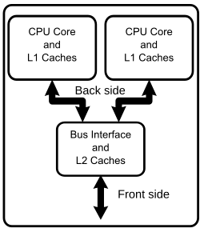

# Jak działa karta graficzna

Współczesne karty graficzne służą już nie tylko do renderowania grafiki ale też do wykonywania skomplikowanych obliczeń. Różnią się od procesora swoją architekturą, w niektórych zadaniach są wolniejsze a w innych znacznie szybsze.

## Różnica między procesorem a kartą graficzną

Procesor komputera posiada kilka rdzeni, zazwyczaj konsumenckie procesory (na stan 2025) zawierają od 4 do 24 rdzeni. Rdzenie te są bardzo wydajne, posiadają wiele skomplikowanych instrukcji, oraz mogą wykonywać różne instrukcje w tym samym czasie na różnych zesetawach danych. Oznacza to że są układami MIMD (Multiple Instruction Multiple Data)

> przykładowa konfiguracja rdzeni, pamięci cache oraz szyn w procesorze \
> źródło - [wikipedia](https://en.wikipedia.org/wiki/Multi-core_processor)

Karta graficzna natomiast jest układem SIMD (Same Instruction Multiple Data). Oznacza to że rdzenie są pogrupowane, i muszą wykonywać te same operacje (Same Instruction) ale mogą je wykonywać na różnych danych (Multiple Data).

Współczesne karty graficzne posiadają setki, a nawet tysiące rdzeni zorganizowanych w strukturę trzystopniową. Rdzenie są podzielone w grupy zwane CU - Compute Unit (w przypadku grafik AMD) lub SM - Streaming MultiProcesor (w przypadku grafik Nvidii)

##  